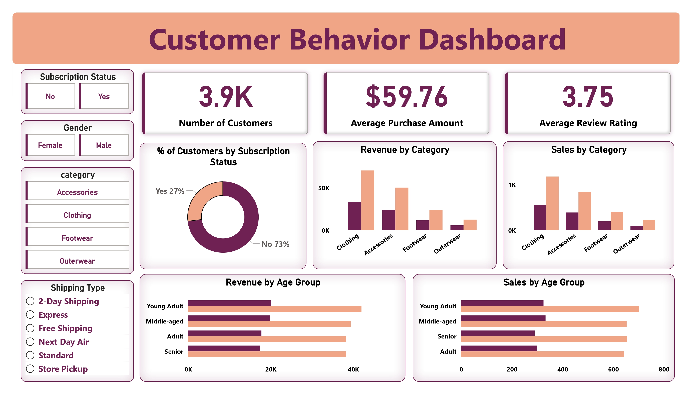

# 🛍️ Customer Shopping Behavior Analysis

An end-to-end data analytics project that analyzes customer shopping behavior using **Python, PostgreSQL, SQL, and Power BI**. The project transforms raw retail transaction data into meaningful business insights through data cleaning, SQL analysis, and interactive dashboarding.

---

## 📌 Overview

This project analyzes **3,900 customer transactions** to uncover shopping patterns, customer preferences, subscription behavior, and revenue opportunities.

The project demonstrates the complete analytics workflow:

- 📊 Data Cleaning & Preprocessing using Python
- 🗄️ Business Analysis using PostgreSQL & SQL
- 📈 Interactive Dashboard Development using Power BI
- 💡 Actionable Business Insights & Recommendations

---

## 🛠️ Technologies Used

- Python (Pandas, NumPy)
- PostgreSQL
- SQL
- Power BI
- Jupyter Notebook

---

## 📂 Repository Contents

| File | Description |
|------|-------------|
| `Customer_Shopping_Behavior_Analysis.ipynb` | Data cleaning, preprocessing, and exploratory analysis using Python |
| `customer_behavior_sql_queries.sql` | SQL queries for business analysis |
| `customer_behavior_dashboard.pbix` | Interactive Power BI dashboard |
| `customer_shopping_behavior.csv` | Customer shopping dataset |
| `dashboard.png` | Dashboard preview image |

---

## 📊 Dataset Summary

- **Records:** 3,900
- **Features:** 18
- **Missing Values:** 37 (Review Rating)

### Key Attributes

- Customer Demographics
- Purchase Amount
- Product Category
- Subscription Status
- Shipping Type
- Discounts & Promo Codes
- Product Ratings
- Purchase Frequency

---

## 🔄 Project Workflow

### 1️⃣ Data Preparation (Python)

- Loaded dataset using Pandas
- Cleaned missing values
- Imputed missing review ratings
- Standardized column names
- Performed feature engineering

### 2️⃣ Business Analysis (SQL)

Performed analysis including:

- Revenue by Gender
- Revenue by Age Group
- Subscribers vs Non-Subscribers
- Customer Segmentation
- High-Spending Discount Users
- Shipping Type Comparison
- Top Rated Products
- Repeat Buyer Analysis
- Discount Dependency
- Top Products by Category

### 3️⃣ Dashboard (Power BI)

Designed an interactive dashboard to visualize:

- Revenue KPIs
- Customer Demographics
- Product Categories
- Subscription Trends
- Shipping Analysis
- Spending Patterns
- Age Group Distribution

---

# 📸 Dashboard Preview

---

## 📈 Dashboard KPIs

- 👥 **Customers:** 3.9K
- 💰 **Average Purchase:** $59.76
- ⭐ **Average Rating:** 3.75
- 📦 **Subscribers:** 27%
- 🛒 **Non-Subscribers:** 73%

---

## 💡 Key Insights

- Subscribers spend more per purchase than non-subscribers.
- Clothing and Accessories generate the highest revenue.
- Young Adults (25–35) contribute the highest number of purchases.
- Express Shipping is associated with higher purchase values.
- Higher-rated products tend to attract more repeat purchases.

---

## 👩‍💻 Author

**Vaibhavi Mahajan**

- LinkedIn
- GitHub
